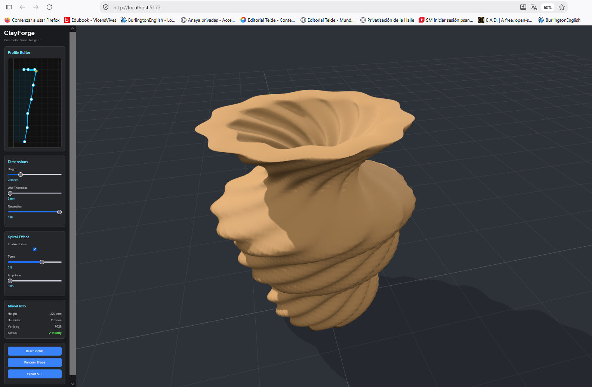

<h1 align="center">ClayForge</h1>

---

## Overview

ClayForge is a browser-based parametric modelling tool focused on vase design.

Instead of modelling directly in 3D, users edit a two-dimensional profile which is converted into a three-dimensional mesh in real time.

The project simplifies the creation of printable vase models through an intuitive interface and instant visual feedback.

Made by **Wilmer Bailon**.

---

<h2>Main Features</h2>

<table width="100%">
<tr>

<td width="25%" valign="top" align="center">

<h3>Interactive Editor</h3>

Create and modify the vase profile by dragging control points directly on the canvas.

<p align="left">

- Real-time editing<br>
- Smooth interaction<br>
- Instant updates

</p>

</td>

<td width="25%" valign="top" align="center">

<h3>3D Preview</h3>

Every change is reflected immediately in the 3D viewport.

<p align="left">

- Orbit controls<br>
- Dynamic lighting<br>
- High-quality rendering

</p>

</td>

<td width="25%" valign="top" align="center">

<h3>Parametric Controls</h3>

Adjust the main parameters of the vase without manually editing the mesh.

<p align="left">

- Height<br>
- Wall thickness<br>
- Mesh resolution<br>
- Spiral deformation

</p>

</td>

<td width="25%" valign="top" align="center">

<h3>STL Export</h3>

Generate an STL file ready for slicing and 3D printing.

<p align="left">

- STL generation<br>
- Slicer compatible<br>
- Ready to print

</p>

</td>

</tr>
</table>

## Photos & Videos

<p align="center">
  
  
</p>
---

## How to Install

Clone the repository

```bash
git clone https://github.com/w7714218-sys/ClayForge-Jar-project.git
```

Go to the project directory

```bash
cd ClayForge-Jar-project/vase-generator
```

Install the dependencies

```bash
npm install
```

Run the application

```bash
npm run dev
```

Open your browser at

```text
http://localhost:5173
```

### Requirements

- Node.js 18+
- npm
- A WebGL compatible browser

---
# Technology Stack

<p>
<p align="center">


</p>

---

<p align="center">

<a href="https://developer.mozilla.org/en-US/docs/Web/JavaScript" target="_blank">

</a>

<a href="https://threejs.org/" target="_blank">

</a>

<a href="https://vitejs.dev/" target="_blank">

</a>

<a href="https://nodejs.org/" target="_blank">

</a>

<a href="https://www.w3.org/html/" target="_blank">

</a>

<a href="https://www.w3schools.com/css/" target="_blank">

</a>

<a href="https://git-scm.com/" target="_blank">

</a>

<a href="https://github.com/" target="_blank">

</a>

<a href="https://code.visualstudio.com/" target="_blank">

</a>

</p>

## Project Structure

```text
vase-generator/

├── assets/
├── libs/
├── exporter.js
├── geometry.js
├── index.html
├── scene.js
├── script.js
├── state.js
├── style.css
├── ui.js
├── package.json
└── vite.config.js
```

---

## License

MIT License

---
<h2>Built during Hack Club Stardance</h2>

<table align="center">
<tr>

<td align="center">
<a href="https://hackclub.com" target="_blank">

</a>
</td>

<td width="50"></td>

<td align="center">
<a href="https://stardance.hackclub.com" target="_blank">

</a>
</td>

</tr>
</table>

<br>

This project was developed as part of **Hack Club Stardance**, a global program that encourages teenagers to build real software and hardware projects while documenting their progress.

Participants create open-source projects, log their development hours, publish devlogs and share their work with the community. As projects are completed, they can earn rewards and gain practical experience by shipping real applications.

A big thank you to **Hack Club** for creating initiatives like Stardance that motivate students around the world to keep building and learning. =)

### Learn more

- Hack Club: https://hackclub.com
- Hack Club Stardance: https://stardance.hackclub.com
